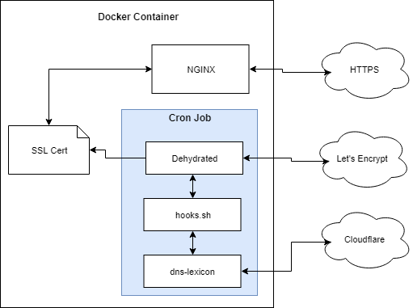

Example repo [here](https://github.com/victorbush/examples.lendd).

The goal of this example is to get a free SSL certificate from a legitimate Certificate Authority that automatically renews itself.

The following requirements are imposed:
* use NGINX running in a Docker container.
* automatically generate and renew SSL certificates.
* automatically update NGINX configuration to use the new certificate.
* use Let's Encrypt as the certificate authority (CA).
* use Cloudflare as the DNS provider.

This article describes the example in two sections:
1. **How it works** - what software is used, how each piece interacts, etc.
2. **How to use it** - how to configure the example and run the Docker container.

## How it Works
### Overview



A custom Docker image is created to satisfy the requirements. It is based off the [official NGINX Docker image](https://hub.docker.com/_/nginx/).

The custom image does two things:
1. Runs an NGINX server.
2. Automatically creates/renews SSL certificates.

Services used:
- [Let's Encrypt](https://letsencrypt.org/) - A legitimate Certificate Authority that provides free SSL certificates.</li>
- [Cloudflare](https://www.cloudflare.com/) - DNS provider. Cloudflare is not required; other DNS providers can be used.</li>

Software used:
- [Docker](https://www.docker.com/) - Containerized application platform.
- [NGINX](http://nginx.org/) - Web server and reverse proxy, among other things.
- [Dehydrated](https://github.com/lukas2511/dehydrated) - a shell-script client for Let's Encrypt.
- `dehydrated.hooks.sh` - a shell script used for callback hooks by Dehydrated.
- [dns-lexicon](https://github.com/AnalogJ/lexicon) - a Python library for interacting with various DNS providers.

### Let's Encrypt
Let's Encrypt provides free SSL certificates. It provides an API that is used to handle the certificate generation requests.

Let's Encrypt requires domain ownership to be validated before issuing an SSL certificate. The basic `http-01` challenge requires a challenge value to be served over HTTP at the path `/.well-known/acme-validation/`. This is not always possible.

The `dns-01` challenge provides an alternative where DNS TXT records are updated with the challenge value. The TXT record is verified by Let's Encrypt, thus validating domain ownership.

The custom Docker image in this example automates this.

### NGINX
NGINX is the primary component of the Docker image. The NGINX server is configured as needed (for example, as a reverse proxy). The configuration points to the generated SSL certificates.

### Dehydrated
Let's Encrypt provides an API to handle creation/renewal of certificates. [Dehydrated](https://github.com/lukas2511/dehydrated) is a shell-script client that interacts with this API.

When the Dehydrated script is called, it will:
- check its configuration for a list of domains to get certificates for.
- compare this list with any existing certificates.
- if no certificates exist, it will try to create them.
- if certificates exist, it will check if they need renewed.
- if certificates need renewed, it will try to renew them.

### Dehydrated Hooks Script
When Dehydrated interacts with the Let's Encrypt API, it executes callback hooks for different parts of the certificate creation process. For example, a hook function is called when:
- a domain needs validated.
- a domain failed validation.
- a domain finished validation (used to cleanup DNS records).
- a certificate was generated.
- a certificate is still valid and wasn't renewed.

The hooks script contains the callback functions and the instructions to perform when each one is called.

### dns-lexicon
During the domain validation process, a DNS TXT record must be updated with a specific challenge value that is provided by Let's Encrypt. dns-lexicon is a Python library that can interact with various DNS providers.

The Dehydrated hooks script takes the DNS challenge value provided by Let's Encrypt and uses the dns-lexicon library to update the DNS record with the challenge. Let's Encrypt then verifies the DNS record was updated and the domain validation passes.

### Cron
A cron job is setup to handle automatic creation/renewal of certificates.

Here is the crontab file being used:
```
@reboot root env - `cat /etc/environment` /app/dehydrated/dehydrated --cron >> /var/log/cron 2>&1
@weekly root env - `cat /etc/environment` /app/dehydrated/dehydrated --cron >> /var/log/cron 2>&1
```

This calls the Dehydrated client once on reboot and once a week after that.

### Put it all together
Let's see how everything works together to create a certificate from Let's Encrypt.
- The cron job executes the Dehydrated client script.
- Dehydrated checks its configuration and determines a certificate has expired and needs renewed.
- Dehydrated connects to Let's Encrypt and initiates the certificate creation process.
- Let's Encrypt responds with a DNS challenge value.
- Dehydrated calls the hooks script with the challenge value.
- The hooks script calls `dns-lexicon` to update the DNS records.
- Dehydrated tells Let's Encrypt the DNS record has been updated.
- Dehydrated waits for the challenge to be verified.
- Let's Encrypt responds saying the challenge was verified.
- Dehydrated calls the hooks script to cleanup after the challenge completed.
- The hooks script calls `dns-lexicon` to remove the DNS record (its not needed anymore).
- Dehydrated downloads the new certificate from Let's Encrypt.
- Dehydrated calls the hooks script and indicates a new certificate was created.
- The hooks script instructs NGINX to reload its configuration to start using the new certificate.

## How to Use It
Download the example repository [here](https://github.com/victorbush/examples.lendd).

There are four steps to get things running:
1. Configure Dehydrated
2. Configure NGINX
3. Build the Docker Image
4. Run the Container

### 1. Configure Dehydrated
This example has a specific Dehydrated configuration. The [official Dehydrated docs](https://github.com/lukas2511/dehydrated/tree/master/docs) are available for alternate configurations.

There are three configuration files to be aware of:

| Directory      | Description  |
| :------------- | :----------- |
| `/etc/dehydrated/config` | Main configuration file for Dehydrated. |
| `/etc/dehydrated/dehydrated.hooks.sh` | Script that is called for different stages of the certificate creation/renewal process. |
| `/etc/dehydrated/domains.txt` | List of domains to create certificates for. |

#### Main Dehydrated config
The main config file mostly uses the default values, except for the following:

```
## Use the dns-01 challenge
CHALLENGETYPE="dns-01"

## Location of the domains.txt file
DOMAINS_TXT="/etc/dehydrated/domains.txt"

## Location of the hooks script
HOOK=/etc/dehydrated/dehydrated.hooks.sh

## Contact email address (to get renewal notifications from Let's Encrypt)
CONTACT_EMAIL=you@example.com
```

Make sure to update the email address in `CONTACT_EMAIL`.

#### Hooks script
The `dehydrated.hooks.sh` script handles the Dehydrated hooks. It is based off [this example](https://github.com/AnalogJ/lexicon/blob/master/examples/dehydrated.default.sh).

The only change was to restart NGINX when new certificates are created (required so NGINX reloads the new certificates).

```
function deploy_cert {
    local DOMAIN="${1}" KEYFILE="${2}" CERTFILE="${3}" FULLCHAINFILE="${4}" CHAINFILE="${5}"

    echo "deploy_cert called: ${DOMAIN}, ${KEYFILE}, ${CERTFILE}, ${FULLCHAINFILE}, ${CHAINFILE}"

    ## Restart nginx so new certificates are reloaded
    nginx -s reload
}
```

#### Domain definition
The `domains.txt` file lists the certificates you want to create and the domains associated with each certificate. For example, the following will create a single certificate with three domains:

```
example.com app1.example.com app2.example.com
```

This certificate will be called `example.com` and also include the two sub-domains.

More details [here](https://github.com/lukas2511/dehydrated/blob/master/docs/domains_txt.md).

*Update*: Let's Encrypt now supports [wilcard certificates](https://community.letsencrypt.org/t/acme-v2-and-wildcard-certificate-support-is-live/55579).

### 2. Configure NGINX
Generated certificates and keys are stored in `/etc/dehydrated/certs/<cert-name>/`. NGINX can be pointed directly to the certificates.

NGINX configuration is beyond the scope of this article, but here is a quick example:

To setup a reverse proxy that takes an incoming HTTPS connection and proxies it to an internal server via HTTP:

```
server {
    listen 443 ssl;
    server_name app1.example.com;
    ssl_certificate /etc/dehydrated/certs/example.com/fullchain.pem;
    ssl_certificate_key /etc/dehydrated/certs/example.com/privkey.pem;

    location / {
        proxy_pass http://10.0.0.1;
    }
}
```

Put this in `/etc/nginx/conf.d/example.conf`.

### 3. Build the Docker Image
The Dockerfile (`src/Dockerfile`) is hopefully self-explanatory. There is a startup script (`src/startup.sh`) that is executed when the Docker container boots up.

To build the image, execute the following while in the `src` directory:

```
docker build -t nginx-dehydrated .
```

This will tag the image as `nginx-dehydrated`. This can be changed as desired.

### 4. Run the Docker Container
#### Mounts
Mount these directories on the host file system or in a Docker volume.

| Directory      | Description  |
| :------------- | :----------- |
| `/etc/dehydrated` | Contains configuration files for the Dehydrated client. Generated files (certificates, account data, etc.) are stored here as well. |
| `/etc/nginx/conf.d` | Additional NGINX configuration files (if needed). |

#### Environment Variables
The DNS provider and credentials used by dns-lexicon are specified using environment variables. If you are not using Cloudflare, then substitute the appropriate variables for your DNS provider (see [here](https://github.com/AnalogJ/lexicon#environmental-variables)).

| Name           | Description  |
| :------------- | :----------- |
| `PROVIDER` | The DNS provider being used. The dns-lexicon library uses this to update DNS records for domain validation. |
| `LEXICON_CLOUDFLARE_USERNAME` | Cloudflare username |
| `LEXICON_CLOUDFLARE_TOKEN` | Cloudflare API key |

#### Example
After building the Docker image, you can run a container with the image.

```
docker run \
    -d \
    --name revprox \
    --restart unless-stopped \
    -p 80:80 \
    -p 443:443 \
    -e PROVIDER=cloudflare \
    -e LEXICON_CLOUDFLARE_USERNAME=yourcloudflarelogin@example.com \
    -e LEXICON_CLOUDFLARE_TOKEN=1231231231321321321321321321321321 \
    -v /host/path/to/mount/etc/dehydrated:/etc/dehydrated \
    -v /host/path/to/mount/etc/nginx/conf.d:/etc/nginx/conf.d \
    nginx-dehydrated
```

Here's what should happen when the container boots:
- If no account data is found in `/etc/dehydrated/accounts`, the startup script will register with Let's Encrypt using the email address provided in the Dehydrated config.
- Cron will start.
- NGINX will start.
- The Dehydrated client will run.
- If certificates need created, it will try to create them.
- If certificates need renewed, it will try to renew them.
- If certificates don't need renewed, it won't renew them.

You can monitor the status of the Dehydrated client using:
```
docker exec -it revprox tail -f /var/log/cron
```

## Notes
### Dehydrated env
Dehydrated seems to require the `env` command to be used to set the environment. If this is not set, you may see an error like this:
```
## INFO: Using main config file /etc/dehydrated/config
ERROR: Lock file '/etc/dehydrated/lock' present, aborting.
```

In the `startup.sh` script, this is done via:
```
env > /etc/environment
```

This also must be done in <code>crontab</code>. See <code>src/crontab</code> for example.

See also: [https://unix.stackexchange.com/questions/103467/what-is-env-command-doing](https://unix.stackexchange.com/questions/103467/what-is-env-command-doing)

## References
- [How to run NGINX with daemon off](https://github.com/nginxinc/docker-nginx/issues/41)
- [Official Dehydrated docs](https://github.com/lukas2511/dehydrated/tree/master/docs)
- [Good example of using Dehydrated](https://blog.thesparktree.com/generating-intranet-and-private-network-ssl)
- Certbot is an alternative method for certificate renewal. Some helpful notes can be found here:
	- [https://reprage.com/post/SSL-with-letsencrypt-nginx-and-docker](https://reprage.com/post/SSL-with-letsencrypt-nginx-and-docker)
	- [https://certbot.eff.org/#debianstretch-nginx](https://certbot.eff.org/#debianstretch-nginx)
- [Example Dockerfile for Dehydrated + dns-lexicon](https://github.com/AnalogJ/lexicon/blob/master/Dockerfile)
- [NGINX reverse proxy docs](https://www.nginx.com/resources/admin-guide/reverse-proxy/)
- [NGINX SSL info](https://www.nginx.com/blog/nginx-ssl/)